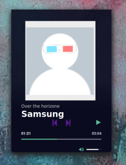

# Browser_Calculator_Django
A simple browser music player based on the Django framework and MediaelEmentPlayer.

## Tech stack
Python, Django, JavaScript, CSS, HTML

## Installation and run

This is an educational project, so you can run it in a development environment and that's how I'll show you here. However, nothing stands in the way of deploying the application to the production environment.

### 1 . Clone the repository
```git clone https://github.com/maciej-MKan/Music_Player_Django.git```

### 2. Make sure you have the Django framework installed and reinstall if necessary.
```python -m django --version```

```pip install django```

### 3. Run application at local host
Make migrations\
```python manage.py makemigrations```\
```python manage.py migrate```

Create a superuser\
```python manage.py createsuperuser```

Run local server\
```python ./manage.py runserver```

__Be careful! This will start the development server__

Go to your browser and enter the address. \
```http://localhost:8000/admin```

Login to the admin page, and add some songs to play them.


Now you can go to main page ```http://localhost:8000``` and play the music.



Have fun :)